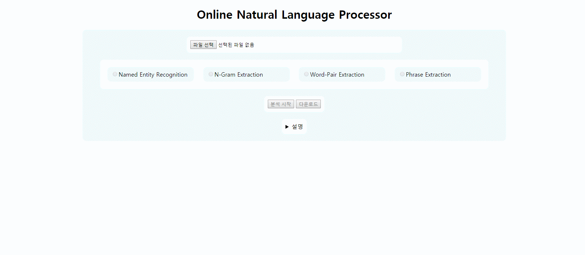
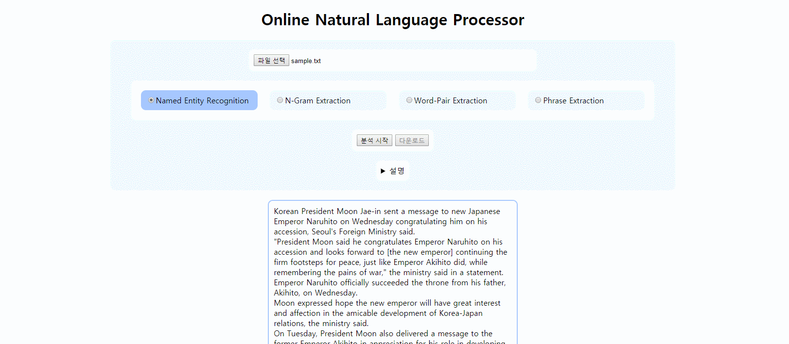
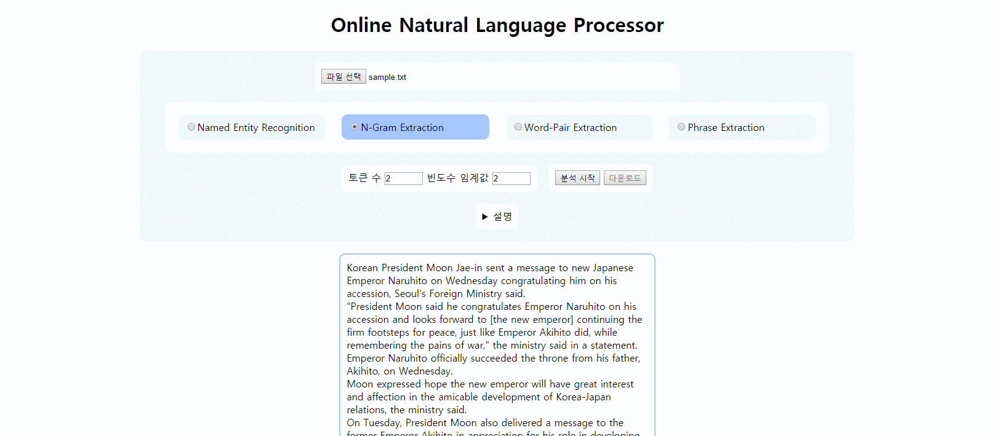
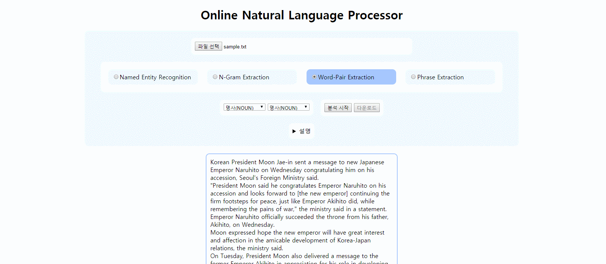
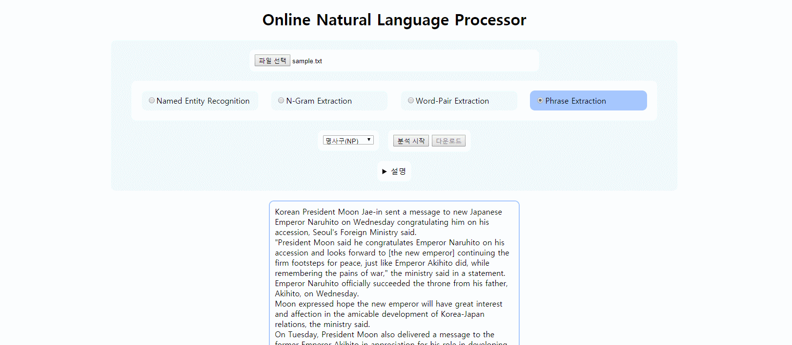
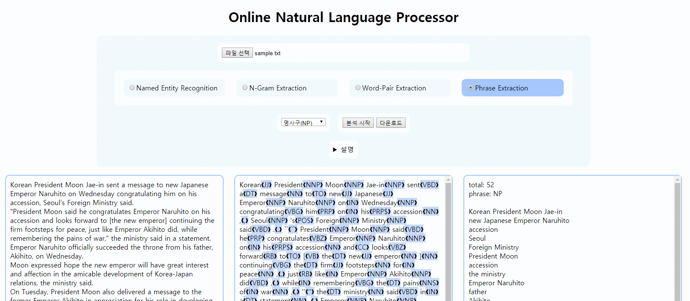

# Online-Natural-Language-Processor

영문 텍스트 파일을 입력 받아 다양한 형태의 nlp를 온라인으로 수행할 수 있는 웹 페이지입니다. 
기능 구현에 NLTK, AWS Comprehend API가 사용되었습니다.
구체적으로 다음과 같은 분석이 가능합니다. 

<ul>
  <li><a href="application/nlp/PosTagger.py"><b>Pos Tagging</b></a>
      
    텍스트를 가공하여 토큰 단위로 품사 태그를 붙여서 출력합니다.
  
  </li>
   
  <li><a href="application/nlp/NamedEntityRecognizer.py"><b>Named Entity Recognition</b></a>
    
    토큰 별 유형 정보를 출력합니다. 
  
  <li><a href="application/nlp/NGramExtractor.py"><b>N-Gram Extraction</b></a>
  
    주어진 문장을 토큰 별로 분할한 뒤, n개 단위로 묶어 n-gram 리스트를 생성합니다.
    문서 내 n-gram들의 빈도수를 측정합니다.
    임계값 이상의 n-gram을 출력합니다.
    
  </li>
  
  <li><a href="application/nlp/WordPairExtractor.py"><b>Word-Pair Extraction</b></a>

    사용자가 두개의 품사를 선택합니다.
    주어진 문장을 토큰 별로 분할한 뒤, 연속되는 토큰의 품사를 조사합니다.
    선택한 품사들과 일치하는 토큰 쌍을 출력합니다.
    
  </li>
  
  <li><a href="application/nlp/PhraseExtractor.py"><b>Phrase Extraction</b></a>
    
    사용자가 추출할 구(Phrase)를 선택합니다.
    주어진 문장 내 해당되는 구를 출력합니다.
    
  </li>
</ul>

Demo

<ul>
  <li>파일 선택</li>
  <li>설명 보기</li>
  <li>Named Entity Recognition</li>
  <li>N-Gram Extraction</li>
  <li>Word-Pair Extraction</li>
  <li>Phrase Extraction</li>
  <li>다운로드</li>
</ul>
