# AWS API Access Key 발급 방법

> Access Key는 <a href="https://aws.amazon.com/ko/what-is-aws/?nc1=f_cc">AWS(Amazon Web Services)</a> 라이브러리 인증 시 필요합니다.<br>
본 프로젝트는 NER(Named Entity Recognition) 수행을 위해 <a href="https://aws.amazon.com/ko/comprehend/features/">Amazon Comprehend</a> 라이브러리를 사용하고 있습니다.

<ol type=number>
  <li><a href="https://aws.amazon.com/ko/console/">AWS Management Console</a>에 로그인합니다.</li><br>
  <li>우측 상단의 <b>내 보안자격 증명</b>으로 이동합니다.<br>
  <br><kbd></kbd></li><br>
  <li><b>Access Key</b>(.csv 파일)을 발급받습니다.<br>
  <br><kbd>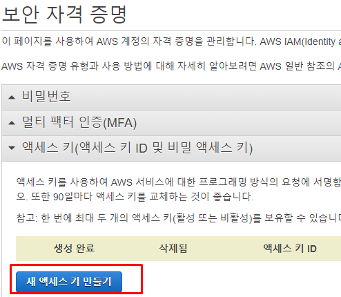</kbd><br>
  <br><kbd>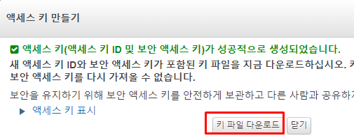</kbd></li><br>
  <li>발급받은 Access Key를 프로젝트 내 <b>application/nlp</b> 경로로 옮깁니다.<br>
  <br><kbd></kbd></li><br>
</ol>

# AWS EC2 인스턴스 생성하기

<ol type=number>
  <li><a href="https://aws.amazon.com/ko/console/">AWS Management Console</a> 중앙의 <b>EC2를 사용하여</b>로 이동합니다.<br>
  <br><kbd></kbd></li><br>
  <li>프리티어 사용 가능이라고 명시된 <b>Ubuntu Server 18.04 LTS (HVM), SSD Volume Type 64비트(X86)</b>를 선택합니다.<br>
  <br><kbd></kbd></li><br>
  <li>프리티어 사용 가능이라고 명시된 인스턴스를 선택하고, <b>검토 및 시작</b> 버튼을 누릅니다.<br>
  <br><kbd>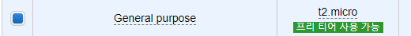</kbd></li><br>
  <li>우측 하단의 <b>시작하기</b> 버튼을 누릅니다.</li><br>
  <li><b>Key Pair</b>(.pem 파일)을 생성하고, <b>인스턴스를 시작</b>합니다.<br>
  <br><kbd>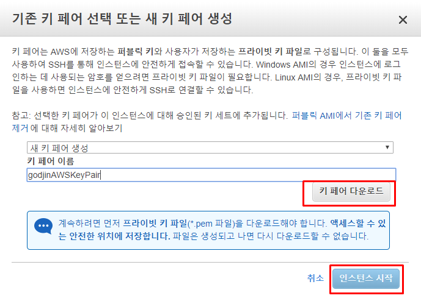</kbd></li><br>
  <li><b>인스턴스 보기</b> 버튼을 누릅니다.</li><br>
  <li><b>보안 그룹</b>을 선택합니다.<br>
  <br><kbd>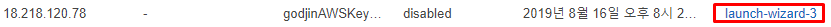</kbd></li><br>
  <li><b>인바운드</b>를 편집합니다.<br>
  <br><kbd>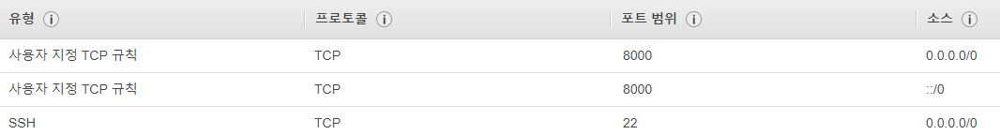</kbd></li><br>
</ol>

# FileZilla를 사용하여 원격 서버로 파일 전송하기

> Windows PC에서 Pycharm으로 작업한 코드들을 Linux 서버로 전송합니다.

<ol type=number>
  <li>상단의 <b>편집 - 설정</b>을 클릭합니다.<br>
  <br><kbd></kbd></li><br>
  <li><b>SFTP - 키 파일 추가</b> 버튼을 눌러서 Key Pair를 선택합니다.<br>
  <br><kbd>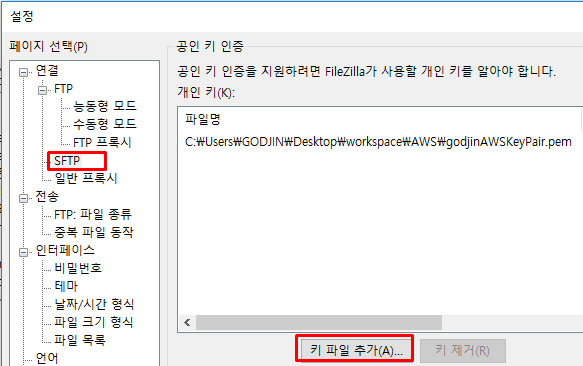</kbd></li><br>
  <li><b>Host에 EC2 Ipv4 퍼블릭 IP 주소, 사용자명 ubuntu, 포트 22</b>를 입력 후 <b>빠른 연결</b> 버튼을 누릅니다.</li><br>
  <li><b>/home/ubuntu</b> 아래 프로젝트 디렉토리를 만들고 PC에서 작업한 코드들을 drag & drop 합니다.<br>
  <br><kbd>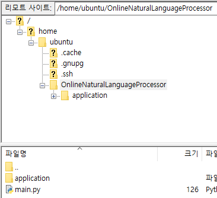</kbd><br>
  <br><kbd>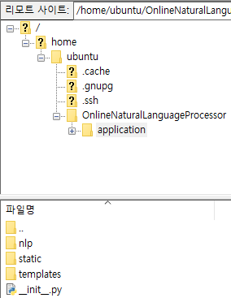</kbd><br>
  <br><kbd>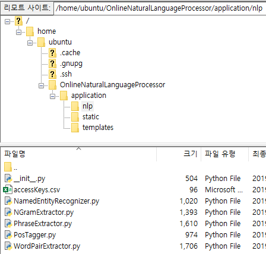</kbd><br>
  <br><kbd></kbd><br>
  <br><kbd>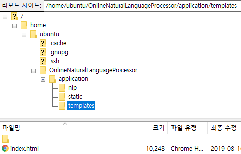</kbd></li><br>
</ol>

# Flask 웹서버 구축하기

1. <b>git bash</b>를 열고 다음 명령어를 입력합니다.
```bash
cd ~/.ssh
vi config
```
2. Host 정보를 저장합니다.<br> 
<b>HostName은 EC2 IPv4 퍼블릭 IP 주소, IdentityFile은 Key Pair가 저장된 경로</b>를 입력합니다.<br>
<br><kbd></kbd>

3. 다음 명령어를 입력합니다. yes/no를 묻는다면 yes를 입력합니다.
```bash
ssh aws
```

4. 원격 서버 접속에 성공하면 다음 명령어를 입력합니다. y/n를 묻는다면 y를 입력합니다.</b>
```bash
sudo apt update
sudo apt install python3-pip
sudo pip3 install flask
sudo pip3 install nltk
cd OnlineNaturalLanguageProcessor/

python3
import nltk
nltk.download('punkt')
nltk.download('averaged_perceptron_tagger')
exit()

# 웹서버를 실행합니다. 아래 두가지 방법 중 하나를 선택합니다.
python3 main.py # user가 터미널을 통해 원격으로 접속하고 있는 동안에만 프로세스가 살아있습니다.
python3 main.py & disown # user 접속 유무와 상관없이 프로세스가 살아있습니다.

# 두번째 방법을 선택한 경우, 프로세스를 종료하는 방법은 다음과 같습니다.
ps -aux | grep python # 프로세스 id를 확인합니다.
kill -9 프로세스 id
```
5. <b>EC2 IPv4 퍼블릭 IP 주소:8000</b>으로 접속합니다.
